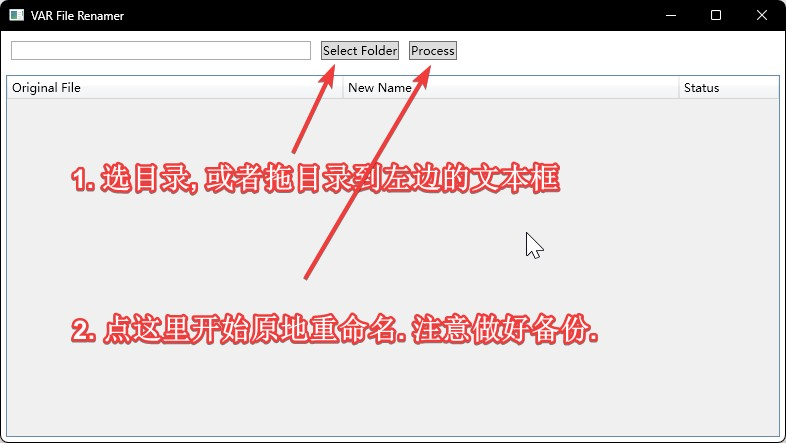
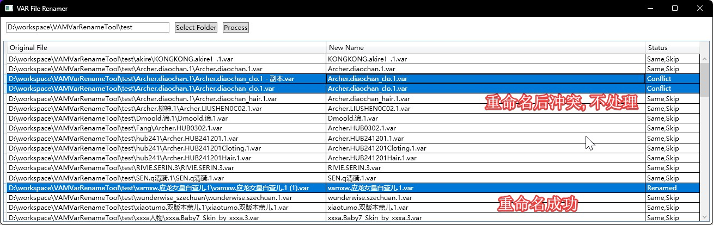

# VAMVarRenameTool
## 简介
原地重命名var文件的小工具. 
重命名策略很简单: 根据meta内容.取作者和包名. 从现有文件名中获取版本号.
最终重命名为, {作者}.{包名}.{版本号}.var
使用前注意备份

VAM的var包因为自身设计思路, meta信息中并不包含version信息.并且VAM自身的var构建工具产出的var包也并不认为meta信息需要和文件名中的对应信息相同.
所以在某些情况下. 要恢复文件名就显得格外困难.
所以在工具文件目录Config中有几个配置文件, 他们的作用是在Creator,Package,以及CreatorPackage级别上做出"正确"的映射. 以便在执行改名的时候尽可能恢复作者原本的var文件名.

Config你可以自行修改, 格式是{meta中的名字},,,{文件名中的名字}
注意分隔符是三个",",半角逗号.

## 可能会做的

1. 重新组织文件夹结构, 以作者名做为子目录分类存放. 非关注作者单独存放到.Dependencies目录中.
2. 分析meta, 找出缺失依赖.
3. 依赖f95zone.SharpVaMTools内置的download连接.做自动补全依赖功能.因为SharpVaMTools内置的下载器我经常无法下载. 但单独提取连接用curl是可以正常下载的.

## 更新
- 2025年2月23日
  - 新增一些改名映射, 应对一些特殊var包
  - 处理案例
    - 14mhz.Plugin-AtomClickTrigger.3.var
    - Abubu Nownanka.EgyptThroneRoom.1.var
    - AcidBubbles.Scripter1.16.var
